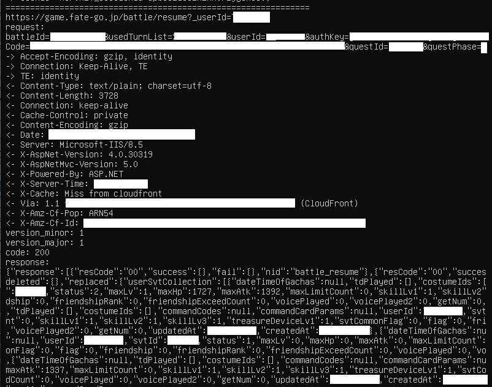

logs fate grand order HTTP traffic through a stub library.



architecture is arm32 only

addresses are dynamically scanned through unity metadata. as long as the
binary doesn't change radically it should update itself

# building (linux)
download the latest android ndk standalone and extract it somewhere

set CC to your ndk location like so and run build.sh

```sh
export CC=~/android-ndk-r20/toolchains/llvm/prebuilt/linux-x86_64/bin/armv7a-linux-androideabi21-clang
./build.sh
```

# usage
have a rooted device with magisk hide enabled for the game. connect over
adb, or just ssh into it

replace the original library

```sh
adb root
adb push libmain.so /data/app/
adb shell

cd /data/app/com.aniplex.fategrandorder-*/lib/arm/
mv libmain.so{,.bak}
mv /data/app/libmain.so .
chmod 755 libmain.so
chown system:system libmain.so
exit
```

clear logcat and start logging

```sh
adb shell logcat -c
adb shell logcat | grep --line-buffered fgohook
```

now start the game and watch the log. I usually pipe the above command into
a file, like
`adb shell logcat -d | grep --line-buffered fgohook > log.txt`
so you can read it in your favorite editor

if it fails to open global-metadata.dat, you might need to change
permissions on the directory it's located at. for example to make it work
on bluestacks I had to do `chmod -R 777 /data/media` as root.

my personal setup is a bit different, I host the binary on a local http
server and then adb shell over lan into my android machine, and wget it
as root using this script from adb shell

```sh
#!/system/bin/sh

PACKAGE_NAME="com.aniplex.fategrandorder"
MAIN_ACTIVITY="jp.delightworks.Fgo.player.AndroidPlugin"
am force-stop "${PACKAGE_NAME}"
cd /data/app/${PACKAGE_NAME}*/lib/arm
[ ! -e libmain.so.bak ] && cp libmain.so libmain.so.bak
wget -O libmain.so 192.168.1.2:8080
chmod 755 libmain.so
chown system:system libmain.so
am start -n  "${PACKAGE_NAME}/${MAIN_ACTIVITY}"
logcat -c
sleep 1
logcat | grep fgohook | sed 's/^.*fgohook\.c: //g'
```
